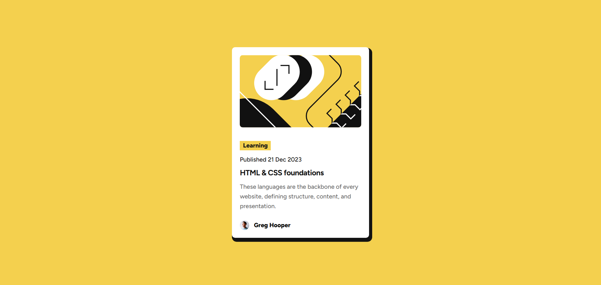
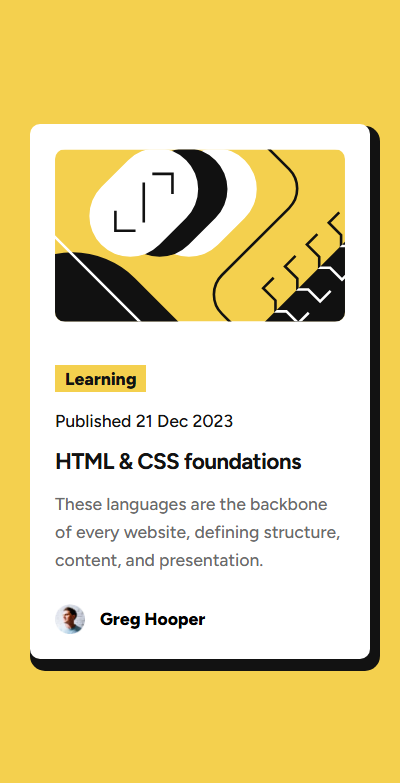

# Frontend Mentor - Blog preview card solution

This is a solution to the [Blog preview card challenge on Frontend Mentor](https://www.frontendmentor.io/challenges/blog-preview-card-ckPaj01IcS). Frontend Mentor challenges help you improve your coding skills by building realistic projects.

## Table of contents

- [Overview](#overview)
  - [The challenge](#the-challenge)
  - [Screenshot](#screenshot)
  - [Links](#links)
- [My process](#my-process)
  - [Built with](#built-with)
  - [What I learned](#what-i-learned)
- [Author](#author)

## Overview

### The challenge

Users should be able to:

- See hover and focus states for all interactive elements on the page

### Screenshot

Desktop view

Mobile view

### Links

- Solution URL: [Github repo](https://github.com/simeon2002/FEM-blog-preview-card)
- Live Site URL: [Blog preview card component](https://blog-preview-card-sim.netlify.app/)

## My process

### Built with

- Semantic HTML5 markup
- CSS custom properties
- Flexbox
- Mobile-first workflow
- Fluid typography using clamp and sizing using min instead of using media query

### What I learned

I learned about the clamp(), min() and max() function how they can be useful to make the website more responsive with just one line of code. I also learnt the simple y = ax + b formula to calculate the preffered value to use to create fluid typography.

## Author

- Frontend Mentor - [@simeon2002](https://www.frontendmentor.io/profile/simeon2002)
- Twitter - [@SimeonSeraf1mov](https://x.com/SimeonSeraf1mov)
